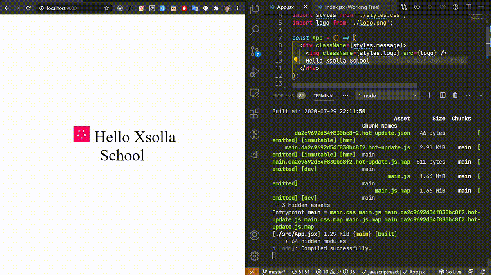

# frontend-project-setup

## Необходимо наличие

1. [Node](https://nodejs.org/en/)
2. Npm (по-умолчанию ставится вместое с node)

Проверка:

```bash
$ node -v
v12.14.1
$ npm -v
6.13.4
```

## Шаги

1. Добавим js и html

2. Инициализируем пакет
   ```bash
   $ npm init
   ```

3. Установим jquey и webpack
   ```bash
   $ npm add jquery
   $ npm add webpack webpack-cli -D
   ```

   Изменим js и html

   ```bash
   $ npx webpack
   ```

4. Сконфигурируем webpack через файл `webpack.config.js` и добавим скрипт
   ```bash
   $ npm run build
   ```

5. Добавим webpack dev server и скрипт
   ```bash
   $ npm add webpack-dev-server nodemon -D
   $ npm run start
   ```

   И откроем браузер http://localhost:9000/

6. Генерируем html через webpack
   ```bash
   $ npm add html-webpack-plugin -D
   ```

7. Добавим стили
   ```bash
   $ npm add style-loader css-loader -D
   ```

8. Воспользуемся css модулями

9. Генерируем css в отдельные файлы, добавляем [HMR](https://webpack.js.org/concepts/hot-module-replacement/)
   ```bash
   $ npm remove style-loader -D
   $ npm add mini-css-extract-plugin -D
   ```

10. Добавим babel и react
    ```bash
    $ npm add babel-loader @babel/core @babel/preset-react -D
    $ npm add react react-dom
    ```

11. Добавим загрузку изображений
    ```bash
    $ npm add file-loader -D
    ```

12. Добавим source maps

13. Добавим поддержку старых браузеров
    ```bash
    $ npm add @babel/preset-env postcss-loader autoprefixer -D
    ```

14. Добавим линтер
    ```bash
    $ npm add eslint eslint-plugin-react babel-eslint -D
    ```

## Домашнее задание

1. Рендерить приложение не в body, а в отдельный элемент с `id='root'`

   https://ru.reactjs.org/docs/rendering-elements.html#rendering-an-element-into-the-dom

2. Добавить Scss

   https://webpack.js.org/loaders/sass-loader/

   Должны быть использованы [переменные](https://sass-scss.ru/guide/#topic-2) в стилях

3. Подключить готовый конфиг для eslint (один из)

   * https://github.com/airbnb/javascript/tree/master/packages/eslint-config-airbnb

   * https://github.com/standard/eslint-config-standard

4. \* Добавить горячую подмену модулей react

   1. Включить механизм HMR в webpack
      https://webpack.js.org/configuration/dev-server/#devserverhot

   2. Включить подмену модулей без перезагрузки страницы
      https://github.com/gaearon/react-hot-loader

   В результате, обновление реакт компонент не должно приводит к перезагрузке всей страницы и состояние приложения не должно сбрасываться (например, поля форм не должны очищаться)
   